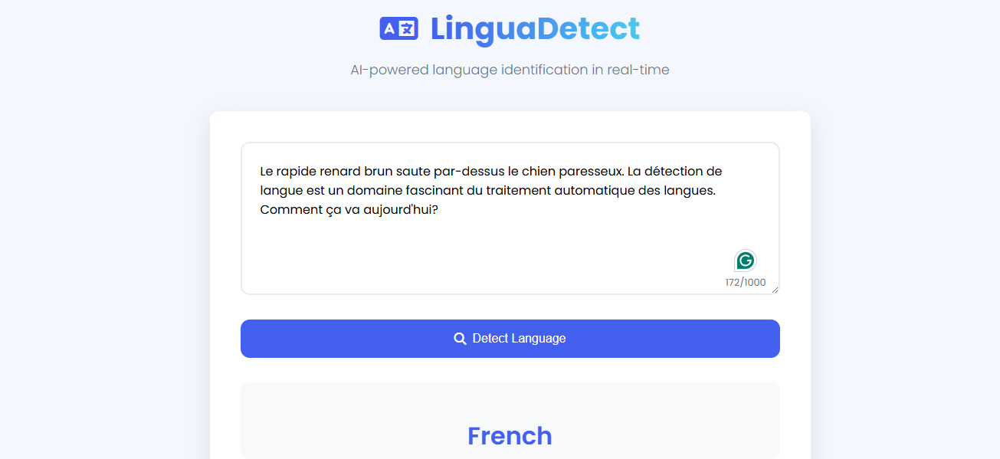

# Language Detection System  

        

A machine learning and deep learning-based system to detect the language of input text. Supports **18+ languages** with **97% accuracy** (BERT).  

## 🚀 **Features**  
- **Traditional ML Models**: Logistic Regression, SVM, Multinominal Naive Bayes, Random Forest, Voting Classifier, Gradient Boosting Classifier, AdaBoost  
- **Deep Learning Models**: LSTM, GRU, CNN, Hybrid, DNN, BERT  
- **Web Interface**: Flask-based UI for real-time predictions  
- **High Accuracy**: Best model (BERT) achieves **97% accuracy**  

## 📂 **Dataset**  
- **Source**: [Language Detection Dataset](https://www.kaggle.com/datasets/basilb2s/language-detection)  
- **Languages**: 18+  
- **Preprocessing**:  
  - Lowercasing  
  - Stopword removal  
  - Stemming  
  - TF-IDF Vectorization  

## 🛠️ **Tech Stack** 
- Python
- TensorFlow
- Scikit-learn
- Flask
- NLTK  

## 📊 **Model Performance**
|  Model | Accuracy |
|----------|----------|
| Logistic Regression | 94.78% |
| SVM | 95.98% |
| Multinominal Naive Bayes | 97.61% |
| Random Forest | 91.48% |
| Gradient Boosting Classifier | 88.03% |
| Voting Classifier | 96.93% |
| Adaboost Classifier | 84.48% |
| LSTM Model | 95.64% |
| GRU Model | 94.88% |
| CNN  Model | 91.43% |
| Hybrid Model | 92.29% |
| DNN Model | 95.69% |
| BERT Model | 97.0% |

## 🌐 **Web Application Interface**

